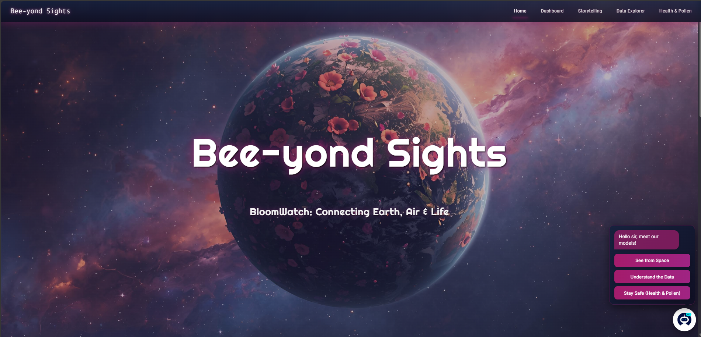

<!-- Banner / Cover Image -->

  

<h1 align="center">🌍 Bee-yond Sights: BloomWatch</h1>
<h3 align="center">AI-Powered Earth Observation Platform for Global Flowering Phenology</h3>

  

---

## Overview

**Bee-yond Sights** is an intelligent, multi-feature Earth observation platform designed to connect **Earth, Air, and Life** through data.  
Built for the **NASA BloomWatch Challenge**, it transforms satellite observations from **NASA**, **ESA**, and other global sources into actionable insights about vegetation bloom events, crop health, and pollen risk across Africa — with future global scalability.

The system integrates **remote sensing**, **machine learning**, and **deep learning** to monitor and forecast environmental change, providing a scientific yet intuitive view of our planet’s ecological pulse.

🔗 **Live Demo:** [bee-yond-sights-kappa.vercel.app](https://bee-yond-sights-kappa.vercel.app)

---

## Key Features

### 1. Africa Environmental Dashboard
- Real-time overview of Africa’s vegetative health.  
- Tracks **active bloom regions**, **rainfall anomalies**, and **climate correlations**.  
- Acts as a “mission control center” for environmental monitoring.

  

### 2. Data Explorer
- Deep analytical tool for **agriculture** and **pollen & health** datasets.  
- Interactive maps, time-series charts, and region/date filters.  
- Enables granular exploration of environmental and vegetation data.

  

### 3. Storytelling — *A Planet’s Pulse*
- Visual narrative that animates long-term climate impact on regions like **Brazil**, **Japan**, and **California**.  
- Uses NDVI, temperature, and rainfall trends to tell data-driven stories about global change.

  

### 4. Predictive AI Services
- Direct interaction with trained AI models:
  - **Crop Health Prediction Model** – Forecasts bloom risk, crop stress, irrigation need, and yield potential.
  - **Pollen Risk LSTM Model** – Detects high pollen risk using deep learning on climate and vegetation sequences.  
- Empowers both **farmers** and **researchers** with AI-powered environmental intelligence.

---

## Data Sources

Bee-yond Sights integrates multiple datasets via **Google Earth Engine (GEE)**:

| Agency | Dataset | Purpose |
|---------|----------|----------|
| **NASA** | SMAP | Soil moisture & drought monitoring |
| **NASA/USGS** | Landsat, MODIS | NDVI, EVI, and long-term vegetation indices |
| **ESA** | Sentinel-2 | High-resolution multispectral vegetation data |
| **ECMWF** | ERA5-Land | Climate variables: temperature, rainfall, humidity, wind |
| **ISRIC** | SoilGrids | Soil composition, organic carbon, fertility indicators |

---

## 🧠 Artificial Intelligence Modules

### BloomWatch Agriculture Model
- **Algorithm:** XGBoost (multi-output classifier)  
- **Input Features:** Vegetation indices (NDVI, EVI, SAVI, NDWI), soil moisture, and climate metrics  
- **Outputs:**  
  - 🌸 *Bloom Risk*  
  - 🌿 *Crop Health*  
  - 💧 *Irrigation Need*  
- **Accuracy:**  
  - Bloom Risk → 91.5%  
  - Crop Health → 94.7%  
  - Irrigation Need → 99.8%

---

### Pollen Risk Deep Learning Model
- **Architecture:** Conv1D + Bidirectional LSTM  
- **Goal:** Predict pollen health risks using time-series environmental data  
- **Accuracy:** ~95–96% test accuracy  
- **Features:** Temperature, Rainfall, Humidity, Wind Speed, NDVI

---

  

## Tech Stack

| Category | Tools & Frameworks |
|-----------|--------------------|
| **Frontend** | React.js, Tailwind CSS, Recharts, Mapbox |
| **Backend / ML** | Python, TensorFlow, Scikit-learn, XGBoost |
| **Data Platform** | Google Earth Engine (GEE), NASA/ESA APIs |
| **Deployment** | Vercel (Frontend), Google Drive / GEE for data |

 ---

## Future Roadmap

- **Automated GEE Data Ingestion:** Real-time data retrieval via authenticated user sessions  
- **CNN-based Bloom Detection:** Spatial analysis from Sentinel-2 imagery  
- **3D Visualization Suite:** Integration with `deck.gl` for immersive data exploration  
- **Global Expansion:** Extend bloom and pollen prediction to other continents

---

<h1 align="center"> Team Bee-yond Sights
<h3 align="center"> Our mission 🌍: To make Earth’s ecological intelligence accessible for everyone.
